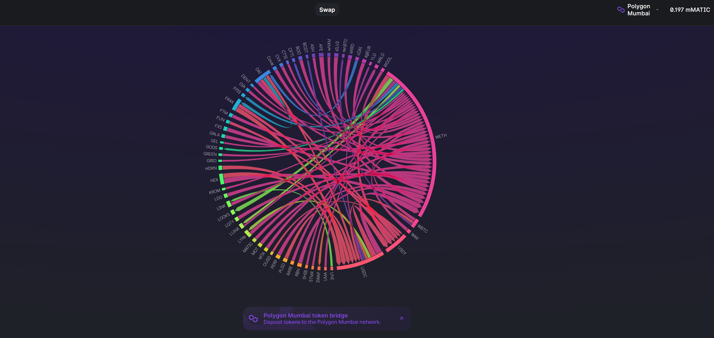

# Decentralized Exchange using Lachesis consensus algorithm

Submission project for HackTheMoney | ETHGlobal 2022

[What is Lachesis?](https://www.fantom.foundation/lachesis-consensus-algorithm/)

[Live Preview](https://lachesiswap.netlify.app/)

<!-- [Presentation](https://www.loom.com/share/439753118c80408984a1c77b41a96bc6) -->




# About the app


We build a decentralized exchange for cross chain swaps, allowing users to swap any token from any chain, in short - An Interchain DEX. 

The popular exchange [Uniswap](https://uniswap.org/) is our starting point for the DEX, which we augment by implementing cross-chain compatibility powered by the SWING api.
The first brick is laid by deploying the Uniswap FactoryV3 contract on Fantom.

Considering the lack of initial liquidity and for the scope of this hackathon, we continue our project on Polygon Mumbai, where the Uniswap contracts are officially deployed and liquidity for 3 token pairs is available. Polygon shares similarity with Fantom by using the PoS consensus, yet it does not provide the asynchronous aspect of the Lachesis algorithm.

## Why Lachesis ?

Lachesis is a break-through aBFT consensus algorithm developed by Fantom.

Below are the key properties of Lachesis algorithm:

```
Asynchronous: Participants have the freedom to process commands at different times.
Leaderless: No participant plays a “special” role.
Byzantine Fault-Tolerant: Functional in a presence of up to one-third of faulty nodes and 
malicious nodes.
Final: Lachesis's output can be used immediately. Transactions are confirmed within 1-2 seconds.
```

## Interchain Swaps

The [SWING api](https://swing.xyz/developers) finds the best & the most efficient bridge in terms of fees and duration. Using SWING, we provide cross-chain swaps and in the future prospect of inter-chain liquidity.
Given the option to select a receiver network, the user can choose to swap his/her token to a different chain.


```
Swing API v0 enables cross-chain token transfers and token swaps through Multichain(Anyswap), Wormhole,
Celer Bridge, deBridge, Hop Bridge, Hyphen bridge, Connext(NXTP), Rainbow bridge, Synapse . 
```

## Data Viz on Swaps & Machine Lacherning 

For analytic purposes, we add an interactive dashboard which visualises in real time the swaps between tokens on Uniswap. The data is fetched from [TheGraph](https://thegraph.com/en/), specifically the UniswapV3 subgraph. For now the user can observe current trends, such as the momentary dump of alt-coins.
In relation to an inter-chain liquidity pool, this data could be used to train ML models to predict demand/supply, avoid shortage and move liquidity when the bridge conditions are most favorable. 


## Roadmap

TheGraph:
  - Build a subgraph which tracks all inter-chain swaps and liquidity.
  - Brute-force pattern recognition. 

Migrating to Fantom
  - Migrating uniswap liquidity pools to Fantom and bridge the swaped tokens.
  - Facilitate migration to Fantom.
  - alternative Idea: implement P2P swap with Lachesis algorithm.

## Fantom

Deploying Uniswap contracts to Fantom testnet. ✅

UniswapV3Factory deployed to: `0x341EC1a1fc2480F400cf33fDc2aC5C95Bdaa3f37`


### Constructor Addresses

Fantom mainnet:
 - Weth: 0x74b23882a30290451A17c44f4F05243b6b58C76d


### Fantom links

[Fantom](https://www.fantom.foundation/lachesis-consensus-algorithm/) and [codeBase](https://github.com/Fantom-foundation/go-opera)

[Wallet](https://pwawallet.fantom.network/#/account/0x3ECC53F7Ba45508483379bd76989A3003E6cbf09/)

[Scan](https://ftmscan.com/address/0x660655EB385467fd95E19aE97a05188d9553B3Ea)

[Docs](https://docs.fantom.foundation/api/public-api-endpoints#mainnet)

[Faucets](https://faucet.fantom.network/)

## L2blockchains & SWING API

[PolygonZero](https://polygon.technology/solutions/polygon-zero/) and [codeBase](https://github.com/mir-protocol/plonky2)

[Swing](https://swing.xyz/developers)


## Hooks & TheGraph

[ETH-hooks](https://scaffold-eth.github.io/eth-hooks/)

[TheGraph](https://thegraph.com/docs/en/developer/quick-start/)

## Pretty Badges

[](https://app.netlify.com/sites/lachesiswap/deploys)


